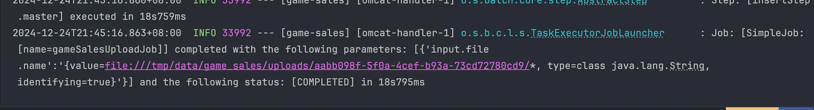
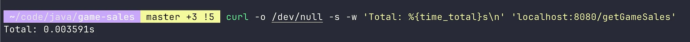

# Game Sales Batch Processing Application

This project is a Spring Boot application designed to process game sales data using **Spring Batch**. It supports
reading data from CSV files, validating and processing the data, and storing it in a database.

## Features

- **Batch Processing**: Uses Spring Batch to process large volumes of game sales data.
- **Partitioning**: Processes multiple input files in parallel for improved performance.
- **Validation**: Ensures data integrity through custom validators.
- **Database Integration**: Writes processed data into a relational database.
- **Error Handling**: Provides mechanisms to handle errors during upload and processing.

---

## Setup and Usage

### Prerequisites

1. Java 21
2. MySQL
3. Gradle

### Installation

1. Build the application:

```bash
./gradlew build
```

1. Run the application:

```bash
./gradlew bootRun
```

---

### Examples

1. Import CSV File

```bash
curl --location 'localhost:8080/import' --form 'file=@"/path/to/game-sales/src/main/resources/game_sales_data.csv"'
```

*Result:*


2. Get Game Sales
```bash
curl --location 'localhost:8080/getGameSales'
```

*Result:*


